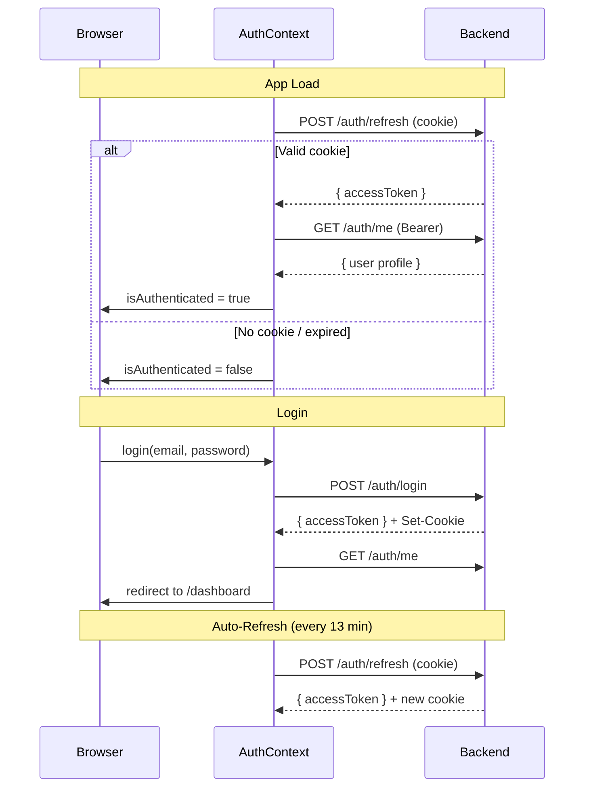

# CollabCode — Walkthrough

## Phase 2.5: Frontend Auth Integration

### New Files

| File | Purpose |
|------|---------|
| [api.ts](file:///c:/Users/adity/Projects/collabcode-ui/src/lib/api.ts) | Central API client, `credentials: "include"` on every request, typed auth endpoints |
| [AuthContext.tsx](file:///c:/Users/adity/Projects/collabcode-ui/src/contexts/AuthContext.tsx) | React Context: in-memory token, auto-refresh on mount + every 13min, login/register/logout |
| [ProtectedRoute.tsx](file:///c:/Users/adity/Projects/collabcode-ui/src/components/ProtectedRoute.tsx) | Route guard: redirects to `/auth` if unauthenticated, branded loading spinner |

### Modified Files

| File | Change |
|------|--------|
| [layout.tsx](file:///c:/Users/adity/Projects/collabcode-ui/src/app/layout.tsx) | Wrapped children in `<AuthProvider>` |
| [Input.tsx](file:///c:/Users/adity/Projects/collabcode-ui/src/components/Input.tsx) | Added `required` and `minLength` props |
| [AuthClient.tsx](file:///c:/Users/adity/Projects/collabcode-ui/src/app/auth/AuthClient.tsx) | Replaced fake `<Link>` login → real API calls, form state, error banner, loading spinner, display name field for signup |
| [DashboardClient.tsx](file:///c:/Users/adity/Projects/collabcode-ui/src/app/dashboard/DashboardClient.tsx) | Wrapped in `<ProtectedRoute>`, real user name/initials from auth context |
| [RoomClient.tsx](file:///c:/Users/adity/Projects/collabcode-ui/src/app/room/%5Bid%5D/RoomClient.tsx) | Wrapped in `<ProtectedRoute>` |

### Auth Flow (Frontend)

### Key Design Decisions

1. **Access token in memory only** — never in localStorage. Lost on page refresh, restored via silent `/refresh` call using HTTP-only cookie
2. **`credentials: "include"`** on every fetch — sends cookies cross-origin
3. **Auto-refresh every 13 minutes** — token expires at 15m, refresh at 13m gives 2-minute buffer
4. **ProtectedRoute** wraps `/dashboard` and `/room/[id]` — shows loading spinner during auth check, redirects to `/auth` if not authenticated

### Verification

| Check | Result |
|-------|--------|
| `npx next build` | ✅ Exit code 0, all 7 pages generated |

---

## Phase 2: Backend Authentication (Previous)

### Auth Endpoints

| Method | Path | Auth | Description |
|--------|------|------|-------------|
| POST | `/api/v1/auth/register` | — | Register + issue tokens |
| POST | `/api/v1/auth/login` | — | Login + issue tokens |
| POST | `/api/v1/auth/refresh` | Cookie | Rotate tokens |
| POST | `/api/v1/auth/logout` | Cookie | Logout current session |
| POST | `/api/v1/auth/logout-all` | Bearer | Logout all sessions |
| GET | `/api/v1/auth/me` | Bearer | Get user profile + plan |
